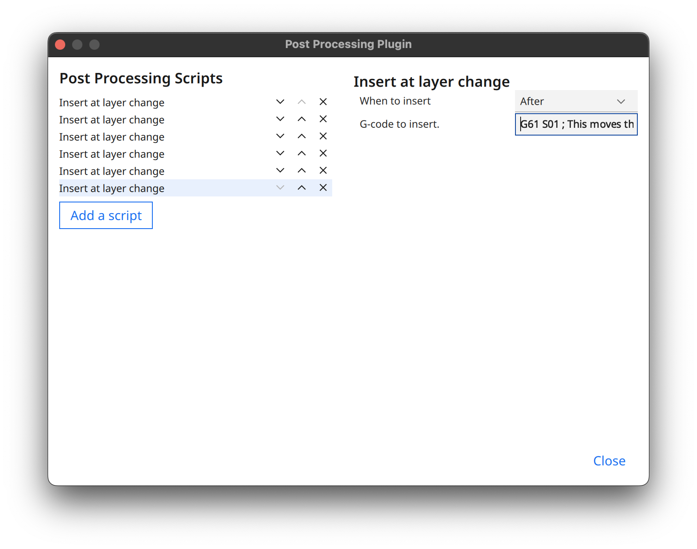

# 3D Printer Time-Lapse

All files and configuration used to generate the time-lapse videos of my 3D prints: https://youtube.com/@print_lapse

## Equipment/software

Here's the equipment/sofware I use:

- An [Artillery Sidewinder X2](https://artillery3d.com/products/artillery-sidewinder-x2-upgrade-version-abl-auto-calibration-3d-printer-550405640mm-larger-printed-size-118111811575-inches-high-precision-dual-37) 3D printer
- A [Raspberry Pi](https://www.raspberrypi.com/) 4 Model B running [OctoPrint](https://octoprint.org/)
- A [Nikon D3000](https://www.nikonusa.com/en/nikon-products/product-archive/dslr-cameras/d3000.html) DLSR camera
- [Ultimaker Cura](https://ultimaker.com/software/ultimaker-cura) for slicing

## Setup

I based my setup on this YouTube tutorial: https://youtu.be/bP0CX42dy3Y

1. Install [OctoPrint](https://octoprint.org/) on the Raspberry Pi, and connect the Pi to your printer via USB
1. Install [`pghoto2`](http://www.gphoto.org/) on the Pi

   - https://askubuntu.com/a/1130666

1. Install [`ffmpeg`](https://ffmpeg.org/) on the Pi
1. Install [`node`](https://nodejs.org/) (version >= 18) on the Pi
1. Plug in your DSLR via USB to the Pi
1. Turn on your DSLR and test `gphoto2` by running `gphoto2 --capture-image` at the command line of the Pi. Your camera should take a picture!
1. Install the [GCODE System Commands](https://plugins.octoprint.org/plugins/gcodesystemcommands/) OctoPrint plugin and configure a new GCODE command - `OCTO1` - to run `gphoto2 --capture-image`
1. Test the setup so far by navigating the **Terminal** tab in OctoPrint and send `OCTO1`. Your camera should take another picture.
1. In Cura, navigate to **Extensions > Post Processing > Modify GCode**. Add a new "Insert at layer change" script for _each_ of the lines below:

   ```gcode
   G60 S01    ; This stores the current location of the hot end to memory
   G0 X0 Y300 ; This moves the hot end to X0 and Y300
   M400       ; Wait for previous commands to finish before continuing
   G4 P0500   ; This pauses the hotend for half a second
   OCTO1      ; This tells OctoPrint to send a command to gphoto2 to take a picture
   G61 S01    ; This moves the hot end back to the location that was stored in memory
   ```

   The end result should be _six_ separate post-processing scripts, each of which contains one of the lines from the GCode above:

   
